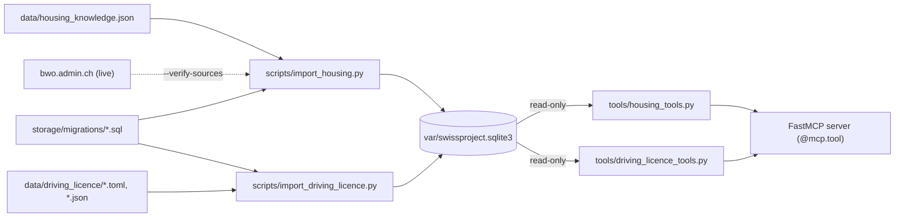

# Housing and driving licence tools

This document explains three MCP tools backed by a local SQLite database:

| Tool | Answers | Data |
|---|---|---|
| `swiss_reference_interest_rate` | Swiss mortgage reference rate for rents (BWO/UFAB) | 1 publication, IT/DE/FR |
| `swiss_housing_info` | Renting guidance: rent adjustments, deposit, termination, defects, ancillary costs… | 18 facts, IT/DE/FR, 8 in Romansh |
| `get_driving_licence_exchange_info` | Exchanging a foreign driving licence: fees, deadlines, requirements | 27 sources (CH + 26 cantons), 216 facts |

They sit next to the existing tools and do not change them. `search_knowledge` and `get_source` use a different database (`~/.swiss-ai-week-mcp/knowledge.sqlite3`); the three tools below read only `var/swissproject.sqlite3`.

## How the pieces fit



1. Reviewed facts live in version-controlled files under `data/`.
2. An import script validates them and writes SQLite. The database is not in Git (`var/` is ignored), so every checkout runs the import once.
3. The MCP server never touches the network for these tools. Each call opens the database read-only, so a re-import is visible immediately.

| Path | Role |
|---|---|
| [`data/housing_knowledge.json`](../data/housing_knowledge.json) | Housing seed: sources, 65 records, verbatim passages |
| [`data/driving_licence/`](../data/driving_licence/) | Licence sources (`.toml`), English research notes (`.en.toml`), structured facts (`_facts.json`), fee audit (`.md`) |
| [`scripts/import_housing.py`](../scripts/import_housing.py) | Housing import and live source verification |
| [`scripts/import_driving_licence.py`](../scripts/import_driving_licence.py) | Licence import |
| [`src/mcp_boilerplate/storage/migrations/`](../src/mcp_boilerplate/storage/migrations/) | Idempotent schema: `001`–`002` licence, `003` housing |
| [`src/mcp_boilerplate/tools/housing_tools.py`](../src/mcp_boilerplate/tools/housing_tools.py) | Reference-rate and housing tools |
| [`src/mcp_boilerplate/tools/driving_licence_tools.py`](../src/mcp_boilerplate/tools/driving_licence_tools.py) | Licence tool |
| `tests/test_*_tool.py`, `tests/unit/test_*_import.py` | Tool behaviour on a DB built from the real seed; import checks |

## Setup

```sh
uv sync --all-extras --dev
uv run python scripts/import_housing.py
uv run python scripts/import_driving_licence.py
uv run pytest -q
```

Set `HOUSING_DB_PATH` or `DRIVING_LICENCE_DB_PATH` (see `.env.example`) when the MCP server should read another file; pass the same path to the importer with `--database`. Restart the MCP client after importing or changing tool code.

## Housing (BWO/UFAB)

### Coverage

Sources, all official BWO/UFAB publications:

- reference-rate page and FAQ (`/it/tasso-di-riferimento`, `/de/referenzzinssatz`, `/fr/taux-de-reference`);
- press release of 1 September 2026 (IT/DE/FR);
- federal vs cantonal competence in tenancy law (IT/DE/FR);
- the "Living in Switzerland" guide (PDF): Italian, German (2026-01-29 edition), French and Romansh.

| Topic | Items |
|---|---|
| `reference_rate` | publication of 2026-09-01 (1.25 %, average 1.31 %), how the rate is determined |
| `rent_adjustment` | FAQ 1–7 and 9: ±0.25 points, larger differences, contract basis, requesting a reduction, increase form, other cost factors, contesting, excluded regimes |
| `jurisdiction` | federal law with cantonal reservations |
| `deposit`, `handover`, `utilities`, `defects`, `alterations`, `termination` | guide chapters |

BWO publishes no Romansh web pages, so Romansh covers the eight guide items only; other items fall back to Italian with a `language_fallback` label. Not covered: rate history, cantonal initial-rent forms, conciliation authority addresses, commercial leases, individual rent calculations.

### Data model

One table, `housing_knowledge` ([migration 003](../src/mcp_boilerplate/storage/migrations/003_housing_knowledge.sql)): one row per fact, language and revision.

- `source_passage` is **verbatim** text from the source. Segments are joined with `[…]`. `summary` and `conditions_json` are editorial and written in the row's language.
- `data_json` holds language-neutral values (codes and numbers; rates in basis points, `125` = 1.25 %). Language variants inherit it from the Italian record, so all languages share the same numbers.
- `scraped_at` is the real time a fetch matched every passage of that source. It is never invented: the import refuses a source that was never verified.
- `published_on`, `source_version_date` and `effective_from` are dates stated by the source, kept separate from the fetch time.
- Re-importing unchanged content creates no duplicate. Changed content creates a new `revision` and keeps the old one with `is_current = 0` for audit. `content_sha256` excludes timestamps.

### Verifying sources

```sh
uv run python scripts/import_housing.py --verify-sources
```

This refetches all 13 sources (HTML and PDF), normalises the text, and checks every passage segment. Only when all passages of a source are found does it write `fetched_at` into the seed. A failed source keeps its previous timestamp and aborts the database update.

### Tool behaviour

`swiss_reference_interest_rate(as_of=None, language="it")`

- Picks the publication whose `effective_from` is on or before `as_of`. The rate is national: the tool never asks for a canton.
- `no_match` before the covered period (history not imported) and on or after the announced next publication (no forecasts). `source_unavailable` if that publication date has passed without a new import.

`swiss_housing_info(question=None, language="it", topic=None, limit=5)`

- Ranks items with a small BM25-style score over title, summary and passage: rare words weigh more, and multilingual topic keywords add a bonus. It then returns each item in the requested language, or labels the Italian fallback.
- `out_of_scope` for cantonal initial-rent forms and conciliation authority addresses, with an orientation URL. Other statuses: `need_info`, `no_match`, `invalid_input`, `source_unavailable`.
- Every result carries the passage, URL, locator, source language, conditions and a `fresh`/`stale` flag based on `next_check_at`.

## Driving licence exchange

### Coverage and data model

- **Sources:** `driving_licence.toml` has one federal entry (CH: VZV/OAC and the ASTRA country lists) and one procedure entry per canton, each with authority, source URL, validation date and legal basis. English research notes are in `driving_licence.en.toml`; the import reads notes only from that file.
- **Facts:** `driving_licence_facts.json` contains 216 facts: 59 fees, 11 deadlines, 146 requirements.
  - Fees are in rappen. `bundle` means the price includes the named service; `component` is a separate line item and must not be summed unless the authority says so.
  - Deadlines have a value, unit and anchor.
  - Requirements have a kind and an effect (`required`, `waived`, `recommended`, `may_be_required`).
- **Conditions** ([migration 002](../src/mcp_boilerplate/storage/migrations/002_driving_licence_facts.sql)): different fields combine with AND, multiple values of one field with OR. Country groups (`ASTRA_A`, `ASTRA_B`, `ASTRA_B_OTHER`, `EU_EFTA`) map ISO country codes. For example, Taiwan is exempt from the control drive only for categories A1 and B.
- **Fee audit:** [`driving_licence_fee_audit.md`](../data/driving_licence/driving_licence_fee_audit.md) lists the verified tariff per canton and the open cases (AR, VD, JU points, NW/OW ranges, SO).
- **Research background:** `BaseKnowledge/SOURCES.md` §9.

### Tool behaviour

`get_driving_licence_exchange_info(canton="CH", fact_type="all")`

- `CH` returns federal rules. A canton code returns federal plus cantonal facts through the `driving_licence_applicable_facts` view. `fact_type` narrows the result to `fee`, `deadline` or `requirement`.
- Each fact includes authority, source URL, validation date and its conditions. The caller must check the conditions against the person's situation. A missing fact means unknown, not free or waived.
- Statuses: `answered`, `no_data`, `invalid_input`, `source_unavailable`.

## Try it

Run `make run-inspector`, or use any MCP client configured in the repo (`opencode.json`, `.codex/config.toml`, `.mcp.json`). Questions with known answers from the database:

| Question | Expected tool | Expected answer |
|---|---|---|
| «Qual è oggi il tasso di riferimento per gli affitti, su quale tasso medio si basa e quando è la prossima pubblicazione?» | `swiss_reference_interest_rate` | 1.25 % from 2026-09-02, average 1.31 % on 2026-06-30, next publication 2026-12-01 |
| «Si je quitte mon logement avant l'échéance, combien de temps le propriétaire a-t-il pour examiner un locataire de remplacement ?» | `swiss_housing_info` | about one month; the French guide says the tenant *doit proposer* a replacement |
| «Quant po importar il deposit e co è quai tar las societads cooperativas?» | `swiss_housing_info` | at most three monthly rents; cooperative shares can be much higher (Romansh edition only) |
| «Combien coûte l'échange d'un permis étranger dans le canton du Jura, sans examen ?» | `get_driving_licence_exchange_info` | CHF 225.75 = 215 tariff points × CHF 1.05 |
| «Was kostet in Zürich der Umtausch, wenn ich für Kategorie C eine Kontrollfahrt machen muss?» | `get_driving_licence_exchange_info` | CHF 50 review + CHF 201 control drive (separate items); CHF 20 identity check on a first application |

## Known limits

- **Tool choice:** some models call `search_knowledge` or the web before these tools, especially when a question names no canton. Check which tool was called before trusting an answer.
- **Housing search:** retrieval is lexical. It keeps the right item near the top but can confuse lexically similar items, for example tenant vs landlord termination in French.
- **Verification differs:** licence facts have a source URL and validation date but no stored verbatim passage and no automated re-verification, unlike housing.
- **No refresh or scheduler:** re-run the importers (and `--verify-sources` for housing) when sources change. The next reference-rate publication is announced for 2026-12-01.
